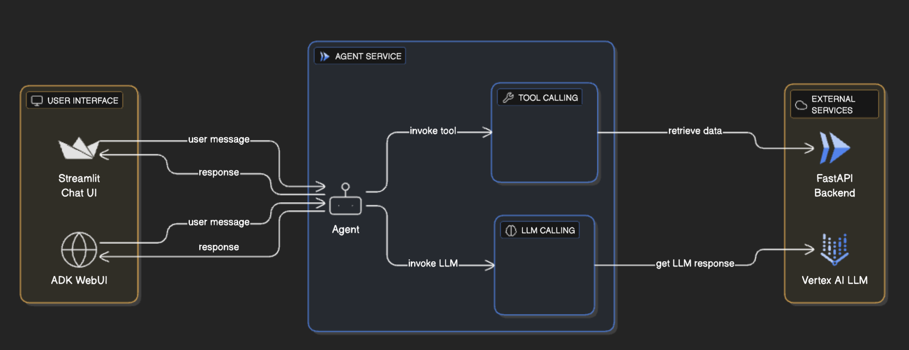

# Website Navigation Agent System

An AI-powered website navigation agent system for Fiction Solutions, built with Google's Agent Development Kit (ADK) and powered by the Gemini 2.5 Flash model. This system provides intelligent assistance to help users learn about company services and navigate the website efficiently.

## System Architecture



The system consists of three main components that work together to provide a seamless conversational experience:

### 🤖 Agent Service (`/agent/`)
**AI Conversational Agent**
- **Technology**: Google ADK + Gemini 2.5 Flash
- **Purpose**: Intelligent website navigation assistant
- **Features**:
  - Dynamic service information retrieval
  - Real-time website navigation assistance
  - Professional customer interaction
  - Context-aware responses and proactive suggestions

### 🌐 Site API (`/site-api/`)
**Backend Data Service**
- **Technology**: FastAPI + Python 3.12+
- **Purpose**: RESTful API for website data
- **Endpoints**:
  - `GET /website/services` - Available services
  - `GET /website/navigation/{section}` - Navigation URLs
- **Data**: JSON-based service and navigation information

### 💬 Chat UI (`/chat-ui/`)
**Web Chat Interface**
- **Technology**: Streamlit
- **Purpose**: Interactive web-based chat interface
- **Features**:
  - Real-time streaming responses
  - Session management
  - Tool usage visualization
  - Multi-endpoint fallback support

## Component Details

### Agent Service Architecture
```
agent/
├── website_agent_service/
│   ├── agent.py          # Main ADK agent configuration
│   ├── tools.py          # API integration tools
│   ├── prompts.py        # System instructions & personality
│   ├── config.py         # Environment configuration
│   └── requirements.txt  # Dependencies
├── pyproject.toml        # Project configuration
└── deploy.sh            # Cloud Run deployment script
```

**Key Features:**
- **Dynamic Data Retrieval**: Uses live API calls instead of hardcoded responses
- **Error Handling**: Robust timeout and retry logic (30s timeouts)
- **Professional Tone**: Maintains friendly, helpful conversation style
- **Tool Integration**: Two main tools for services and navigation

### Site API Architecture
```
site-api/
├── app.py               # FastAPI route definitions
├── main.py             # Application entry point
├── config/
│   ├── settings.py     # Environment configuration
│   └── logging.py      # Google Cloud Logging setup
├── service/
│   └── website.py      # Business logic
├── data/
│   ├── website-services.json     # 7 available services
│   └── website-navigation.json   # 7 navigation sections
└── deploy.sh           # Cloud Run deployment script
```

**Available Services:**
- Web Development
- Mobile App Development  
- Cloud DevOps
- Software Development
- UI/UX Design
- Data and AI
- Cybersecurity

### Chat UI Architecture
```
chat-ui/
├── app.py              # Streamlit chat application
├── pyproject.toml      # Dependencies
├── Dockerfile          # Container configuration
└── deploy.sh          # Cloud Run deployment script
```

**Features:**
- **Multi-endpoint Support**: Automatically tries `/run_sse`, `/run`, `/chat`, `/`
- **Streaming Responses**: Real-time Server-Sent Events (SSE) support
- **Session Management**: Stateful conversations with the agent
- **Tool Visualization**: Shows function calls and responses
- **Debug Mode**: Raw response inspection

## System Data Flow

1. **User Input** → Chat UI receives user message
2. **API Request** → Chat UI sends request to deployed Agent Service
3. **Tool Execution** → Agent calls Site API endpoints for live data
4. **Data Retrieval** → Site API loads and returns JSON data
5. **Response Generation** → Agent processes data and generates conversational response
6. **Streaming Response** → Response flows back through the system to user

## Quick Deployment

Each component can be deployed independently to Google Cloud Run:

### 1. Deploy Site API (Backend)
```bash
cd site-api
chmod +x deploy.sh
./deploy.sh
```

### 2. Deploy Agent Service
```bash
cd agent
chmod +x deploy.sh
./deploy.sh
```

### 3. Deploy Chat UI (Frontend)
```bash
cd chat-ui
chmod +x deploy.sh
./deploy.sh
```

## Prerequisites

- **Python 3.12+**
- **Google Cloud SDK** with authenticated account
- **uv** package manager
- **Docker** (for containerized deployment)
- **Google Cloud Project** with:
  - Vertex AI API enabled
  - Cloud Run API enabled
  - Artifact Registry API enabled

## Environment Configuration

Each component requires specific environment variables:

### Agent Service
```bash
GOOGLE_CLOUD_PROJECT=your-project-id
GOOGLE_CLOUD_LOCATION=us-central1
GOOGLE_GENAI_USE_VERTEXAI=1
WEBSITE_API_URL=https://your-site-api-url.run.app/api
```

### Site API
```bash
GCLOUD_PROJECT_ID=your-project-id
GCLOUD_REGION=us-central1
GOOGLE_APPLICATION_CREDENTIALS={"type":"service_account",...}
```

### Chat UI
```bash
PROJECT_ID=your-project-id
LOCATION=us-central1
SERVICE_NAME=website-chat-ui
```

## Development Workflow

### Local Development
1. **Start Site API**: `cd site-api && uv run python main.py`
2. **Run Agent**: `cd agent && adk run website_agent_service`  
3. **Launch Chat UI**: `cd chat-ui && uv run streamlit run app.py`

### Testing the System
1. Configure Chat UI with your deployed agent URL
2. Start a conversation: *"Hi, what services do you offer?"*
3. Test navigation: *"Can you show me your pricing page?"*
4. Verify tool usage in the debug panel

## Key Features

- **🔄 Dynamic Data**: All responses use live API data, not hardcoded information
- **🛠️ Tool Integration**: Transparent function calling with detailed logging
- **💬 Conversational AI**: Natural language processing with context awareness  
- **🌐 Multi-endpoint**: Robust failover mechanisms for different API patterns
- **📊 Monitoring**: Comprehensive logging and error tracking
- **🔒 Security**: Proper authentication and CORS configuration

## Architecture Benefits

- **Scalability**: Each component can be scaled independently
- **Maintainability**: Clear separation of concerns between UI, agent logic, and data
- **Flexibility**: Easy to modify services or navigation without code changes
- **Reliability**: Multiple fallback mechanisms and comprehensive error handling
- **Observability**: Detailed logging and monitoring throughout the system

## Technology Stack

| Component | Framework | Language | Cloud Service |
|-----------|-----------|----------|---------------|
| Agent Service | Google ADK | Python 3.12 | Cloud Run |
| Site API | FastAPI | Python 3.12 | Cloud Run |
| Chat UI | Streamlit | Python 3.12 | Cloud Run |
| Data Storage | JSON Files | - | Static Files |
| AI Model | Gemini 2.5 Flash | - | Vertex AI |

## Component Documentation

For detailed setup, configuration, and troubleshooting information for each component:

| Component | Quick Link | Description |
|-----------|------------|-------------|
| 🤖 **Agent Service** | [agent/README.md](agent/README.md) | Google ADK agent setup, tools, and deployment |
| 🌐 **Site API** | [site-api/README.md](site-api/README.md) | FastAPI backend configuration and endpoints |  
| 💬 **Chat UI** | [chat-ui/README.md](chat-ui/README.md) | Streamlit interface setup and usage |

## Support & Documentation

- Component-specific README files available in each subfolder (linked above)
- Deployment scripts include comprehensive error handling and validation
- All code includes extensive logging for debugging and monitoring
- Interactive API documentation available at `/api/docs` endpoints