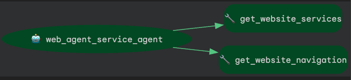

# Website Navigation Agent

This project implements an AI-powered website navigation agent for Fiction Solutions, a fictional technology company offering professional services including cloud solutions, mobile app development, and cybersecurity. The agent is designed to help users learn about the company's services and navigate the website efficiently.

## Overview

The Website Navigation Agent serves as an intelligent assistant for Fiction Solutions' website visitors. Built with Google's Agent Development Kit (ADK) and powered by the Gemini 2.5 Flash model, it provides real-time information about company services, guides users to relevant website sections, and engages in friendly, professional conversations. The agent dynamically fetches service data from backend APIs rather than using hardcoded responses.

## Agent Details

The key features of the Website Navigation Agent include:

| Feature            | Description          |
| ------------------ | -------------------- |
| _Interaction Type_ | Conversational       |
| _Complexity_       | Basic                |
| _Agent Type_       | Single Agent         |
| _Components_       | Tools, API           |
| _Vertical_         | Technology Services  |

### Agent Architecture

The agent is built using Google ADK (Agent Development Kit) and integrates with the Fiction Solutions website backend API to provide real-time information about services and navigation links.



The diagram above illustrates the agent's tool calling architecture, showing how user queries trigger specific tool calls to fetch live data from backend APIs.

### Key Features

- **Service Information Management:**
  - Retrieves current service offerings from the backend API
  - Presents services in clear, friendly language
  - Always uses live data rather than hardcoded information

- **Website Navigation Assistance:**
  - Provides direct links to specific website sections
  - Helps users find contact information, pricing, and other pages
  - Uses dynamic navigation mapping from backend API

- **Professional Customer Interaction:**
  - Maintains friendly, professional tone
  - Engages in appropriate small talk and greetings
  - Asks clarifying questions when user requests are unclear

- **Proactive Assistance:**
  - Suggests related services based on conversation context
  - Offers next steps and additional help
  - Provides clear, actionable guidance

#### Tools

The agent has access to the following tools that enable dynamic data retrieval:

- **`get_website_services() -> dict`**: Retrieves the current list of services from the backend API
  - Endpoint: `{WEBSITE_API_URL}/website/services`
  - Returns live service data instead of hardcoded information
  - Includes error handling with timeout and retry logic

- **`get_website_navigation(section: str) -> dict`**: Returns navigation URLs for specific website sections
  - Endpoint: `{WEBSITE_API_URL}/website/navigation/{section}`
  - Provides direct links to website sections (pricing, contact, about, etc.)
  - Enables dynamic navigation based on current website structure

Both tools implement robust error handling, request timeouts (30 seconds), and proper logging for monitoring and debugging.

## Local Development Setup

### Prerequisites

- Python 3.12+
- [uv](https://docs.astral.sh/uv/getting-started/installation/) (for dependency management)
- [Google Cloud SDK](https://cloud.google.com/sdk/docs/install)
- Google Cloud Project with Vertex AI enabled

### Quick Start

1. **Clone and navigate to the project:**
   ```bash
   git clone https://github.com/ericgbekor/website-guide-agent
   cd website-navigation-agent/agent
   ```

2. **Install uv (if not already installed):**
   ```bash
   curl -LsSf https://astral.sh/uv/install.sh | sh
   # or
   pip install uv
   ```

3. **Set up virtual environment and dependencies:**
   ```bash
   uv sync
   source .venv/bin/activate
   ```

4. **Google Cloud Setup:**
   ```bash
   # Install and authenticate with Google Cloud SDK
   gcloud auth login
   gcloud auth application-default login
   
   # Enable required APIs
   gcloud services enable aiplatform.googleapis.com
   ```

5. **Environment Configuration:**
   
   Create a `.env` file in the project root:
   ```bash
   # Required Google Cloud Configuration
   GOOGLE_CLOUD_PROJECT=your-project-id
   GOOGLE_CLOUD_LOCATION=us-central1
   GOOGLE_GENAI_USE_VERTEXAI=1
   
   # Backend API Configuration
   WEBSITE_API_URL=https://your-backend-api.com/api
   
   # Optional: Google API Key (if not using Vertex AI)
   GOOGLE_API_KEY=your-api-key
   ```

6. **Verify Configuration:**
   ```bash
   python -c "from website_agent_service.config import Config; print(Config())"
   ```

## Running the Agent Locally

### CLI Mode
```bash
# Ensure virtual environment is activated
source .venv/bin/activate

# Run the agent in command-line interface
adk run website_agent_service
```

### Web UI Mode
```bash
# Start the ADK web interface
adk web
```
Then:
1. Open your browser to the provided URL (typically `http://localhost:8080`)
2. Select `website_agent_service` from the dropdown menu
3. Start chatting with the agent

### Development Mode
For development with auto-reload:
```bash
# Run with verbose logging
export PYTHONPATH=$PYTHONPATH:$(pwd)
adk run website_agent_service --debug
```

### Example Interaction

Here's a quick example of how a user might interact with the agent:

**User:** Hi there! I'm interested in learning about your services.

**Agent:** Hello! Welcome to Fiction Solutions. I'd be happy to help you learn about our professional technology services. Let me get you the latest information about what we offer.

[Agent uses `get_website_services` tool to retrieve current services]

**Agent:** We currently offer several professional services including cloud solutions, mobile app development, and cybersecurity services. Each service is designed to help businesses leverage technology effectively. Would you like me to provide more details about any specific service, or help you navigate to a particular section of our website?

**User:** I'd like to see your pricing information.

**Agent:** I can help you navigate to our pricing page. Let me get that link for you.

[Agent uses `get_website_navigation` tool with "pricing" section]

**Agent:** Here's the direct link to our pricing page: [https://fictionsolutions.com/pricing]. You'll find detailed pricing information for all our services there. Is there anything specific about our pricing structure you'd like me to help clarify?


## Configuration Management

Configuration is handled through [website_agent_service/config.py](./website_agent_service/config.py) using Pydantic settings:

| Parameter | Description | Default | Required |
|-----------|-------------|---------|----------|
| `GOOGLE_CLOUD_PROJECT` | GCP Project ID | `my_project` | Yes |
| `GOOGLE_CLOUD_LOCATION` | GCP Region | `europe-west2` | Yes |
| `GOOGLE_GENAI_USE_VERTEXAI` | Use Vertex AI | `1` | Yes |
| `WEBSITE_API_URL` | Backend API URL | `""` | Yes |
| `GOOGLE_API_KEY` | Google API Key | `""` | No |
| `agent_settings.name` | Agent Name | `web_agent_service_agent` | No |
| `agent_settings.model` | LLM Model | `gemini-2.5-flash` | No |

## Cloud Deployment

### 🚀 Recommended: Using deploy.sh Script

The easiest way to deploy the Agent Service is using the included deployment script that handles Google Cloud Run deployment automatically:

1. **Configure deployment settings:**
   Edit `deploy.sh` and update the configuration section:
   ```bash
   # Set your Google Cloud Project ID
   export GOOGLE_CLOUD_PROJECT="your-project-id"
   
   # Set your desired Google Cloud Location
   export GOOGLE_CLOUD_LOCATION="us-central1"
   
   # Set the path to your agent code directory
   export AGENT_PATH="./website_agent_service"
   
   # Set a name for your Cloud Run service
   export SERVICE_NAME="website-agent-service"
   
   # Set an application name
   export APP_NAME="website-agent-app"
   ```

2. **Make script executable and deploy:**
   ```bash
   chmod +x deploy.sh
   ./deploy.sh
   ```

   The script will:
   - Deploy the agent to Google Cloud Run
   - Include web UI interface
   - Enable cloud tracing
   - Output the deployment URL and service details

### Manual Deployment (Alternative)

If you prefer manual deployment using ADK directly:

```bash
adk deploy cloud_run \
  --project="your-project-id" \
  --region="us-central1" \
  --service_name="website-agent-service" \
  --app_name="website-agent-app" \
  --with_ui \
  --trace_to_cloud \
  "./website_agent_service"
```

### Testing Deployment

After deployment, you can test the agent using the following methods:

#### Method 1: Web Interface
- Navigate to the Cloud Run service URL provided after deployment (typically: `https://website-agent-service-[hash]-uc.a.run.app`)
- Access the web UI to interact with the agent directly through the browser

#### Method 2: Health Check
```bash
# Check if the deployed service is running
curl https://your-service-url.run.app/

# The service should return a response indicating it's running
```

#### Method 3: Direct API Integration
If you need to integrate with the deployed agent programmatically, you can use the ADK client to connect to your Cloud Run service. The exact integration method will depend on your specific implementation needs.

## Troubleshooting

### Common Issues

1. **Authentication Errors:**
   ```bash
   # Re-authenticate with Google Cloud
   gcloud auth login
   gcloud auth application-default login
   ```

2. **API Not Enabled:**
   ```bash
   # Enable required APIs
   gcloud services enable aiplatform.googleapis.com
   gcloud services enable cloudbuild.googleapis.com
   gcloud services enable run.googleapis.com
   ```

3. **Environment Variables Not Set:**
   ```bash
   # Check current environment
   env | grep GOOGLE
   
   # Export missing variables
   export GOOGLE_CLOUD_PROJECT=your-project-id
   export GOOGLE_CLOUD_LOCATION=us-central1
   ```

4. **Backend API Connection Issues:**
   - Verify `WEBSITE_API_URL` is correctly set
   - Ensure the backend API is accessible
   - Check API endpoints return expected JSON format

5. **Deployment Failures:**
   ```bash
   # Check Cloud Run service logs
   gcloud run services logs read website-agent-service \
     --region=us-central1
   
   # Check recent builds
   gcloud builds list --limit=5
   
   # View specific build logs
   gcloud builds log [BUILD_ID]
   ```

6. **Service Not Responding:**
   ```bash
   # Check service status
   gcloud run services describe website-agent-service \
     --region=us-central1
   
   # Check if service is receiving traffic
   gcloud run services list --filter="website-agent-service"
   ```

### Getting Help

- Check the [Google ADK Documentation](https://cloud.google.com/vertex-ai/generative-ai/docs/agent-development/overview)
- Review [Cloud Run Documentation](https://cloud.google.com/run/docs)
- For agent logic issues, check the logs in `website_agent_service/`
- For deployment issues, review the `deploy.sh` script configuration